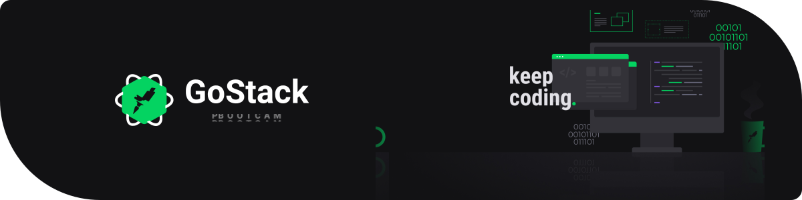

<h3 align="center">Rocketseat GoStack Challenges </h3>
<blockquote align="center">“Don't wait to plant, just be patient to haverst!"</blockquote>

  
  
  

  <a href="#-about">About</a>&nbsp;&nbsp;&nbsp;|&nbsp;&nbsp;&nbsp;
  <a href="#-list-of-challenges">List of Challenges</a>&nbsp;&nbsp;&nbsp;|&nbsp;&nbsp;&nbsp;
  <a href="#-what-is-gostack">What is GoStack?</a>&nbsp;&nbsp;&nbsp;

 

## &nbsp; About

This repository contains all the resolutions of the challenges proposed during <b><a href="https://github.com/Rocketseat">@Rocketseat</a></b> GoStack bootcamp.

The description of each challenge you encounter within the `readme.md` of earch directory.
  

## &nbsp; List of challenges

- [00: Node.js Concepts](https://github.com/jbresolinn/rocketseat-gostack-challenges/tree/master/00-nodejs-concepts)
- [01: ReactJS Concepts](https://github.com/jbresolinn/rocketseat-gostack-challenges/tree/master/01-reactjs-concepts)
- [02: React Native Concepts](https://github.com/jbresolinn/rocketseat-gostack-challenges/tree/master/02-reactnative-concepts)
- [03: Node.js Fundamentals](https://github.com/jbresolinn/rocketseat-gostack-challenges/tree/master/03-nodejs-fundamentals)
- 04: Database and Files Upload with NodeJS
- 05: ReactJS Fundamentals
- 06: React Native Fundamentals
- 07: Database relationships in Node.js
- 08: CRUD in ReactJS
- 09: Navigation and filters in React Native
    

## &nbsp; What is GoStack?

Bootcamp GoStack is an immersive training program with the most modern web and mobile development technologies developed and applied by <b>[@Rocketseat](https://github.com/Rocketseat)</b>.

You can learn more about <b>[here](https://rocketseat.com.br/gostack)</b>.

---

Made with ❤ by Julia Bresolin!  
[Follow me on social networks!](https://linktr.ee/juliabresolin)
